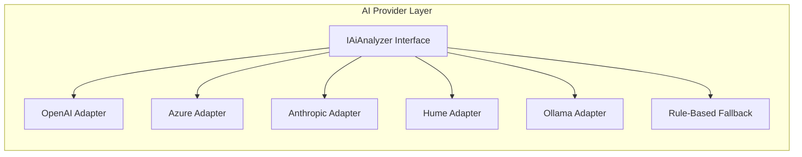

# AI Provider Options – hellotali

This document outlines AI API options for sentiment analysis, emotion detection, and NLP tasks in the HelloTali mood monitoring application.

---

## Table of Contents

- [Current Architecture](#current-architecture)
- [Cloud AI APIs](#cloud-ai-apis)
- [Specialized Emotion/Mental Health APIs](#specialized-emotionmental-health-apis)
- [Self-Hosted / Local Options](#self-hosted--local-options)
- [Ollama Hardware Requirements & Costs](#ollama-hardware-requirements--costs)
- [Raspberry Pi for AI](#raspberry-pi-for-ai)
- [Build vs Buy: Cost Analysis](#build-vs-buy-cost-analysis)
- [Voice Processing APIs](#voice-processing-apis)
- [Cost & Quality Comparison](#cost--quality-comparison)
- [Recommended Strategy](#recommended-strategy)
- [Implementation Notes](#implementation-notes)

---

## Current Architecture

HelloTali uses a pluggable `IAiAnalyzer` interface, allowing easy swapping of AI providers:

```csharp
public interface IAiAnalyzer
{
    Task<AnalysisResult> AnalyzeTextAsync(string userId, string text, CancellationToken ct = default);
}
```

Implementations:
- `OpenAiGptAnalyzer` — Default (GPT-4o-mini)
- `AzureTextAnalyzer` — Optional (Azure Cognitive Services)
- `RuleBasedAnalyzer` — Fallback stub

---

## Cloud AI APIs

### General-Purpose NLP

| Provider | API | Best For | Pricing Model | Healthcare Compliance |
|----------|-----|----------|---------------|----------------------|
| **OpenAI** | GPT-4o / GPT-4o-mini | Nuanced understanding, conversational | Per token | BAA available |
| **Anthropic** | Claude 3.5 Sonnet/Haiku | Safety-focused, nuanced reasoning | Per token | BAA available |
| **Google Cloud** | Natural Language API | Sentiment, entities, syntax | Per request | HIPAA with BAA |
| **Azure** | Text Analytics / Language | Sentiment, health text, PII detection | Per request | HIPAA compliant |
| **AWS** | Comprehend | Sentiment, entities, key phrases | Per request | HIPAA eligible |
| **Cohere** | Classify / Embed | Text classification, embeddings | Per request | Contact for compliance |
| **IBM Watson** | NLU | Sentiment, emotion, concepts | Per request | HIPAA eligible |

### Provider Details

#### OpenAI (Current Default)
- **Models:** GPT-4o, GPT-4o-mini, GPT-4-turbo
- **Strengths:** Best overall quality, handles nuance well, good at following instructions
- **Pricing:** ~$0.15/1M input tokens (GPT-4o-mini)
- **Use case:** Primary analyzer for mood and cognitive assessment
- **Docs:** https://platform.openai.com/docs

#### Anthropic Claude
- **Models:** Claude 3.5 Sonnet, Claude 3 Haiku
- **Strengths:** Strong safety training, less likely to produce harmful content, good reasoning
- **Pricing:** ~$0.25/1M input tokens (Haiku)
- **Use case:** Alternative to OpenAI, especially for sensitive mental health content
- **Docs:** https://docs.anthropic.com

#### Azure Text Analytics
- **Features:** Sentiment analysis, key phrases, entity recognition, healthcare text mining
- **Strengths:** Enterprise-grade, HIPAA compliant out of box, integrates with Azure ecosystem
- **Pricing:** ~$1/1K text records
- **Use case:** Healthcare-focused deployments requiring compliance
- **Docs:** https://learn.microsoft.com/azure/cognitive-services/language-service

#### Google Cloud Natural Language
- **Features:** Sentiment, entity analysis, syntax analysis, content classification
- **Strengths:** Multi-language support, fast response times
- **Pricing:** ~$1/1K units
- **Use case:** Multi-language support needed
- **Docs:** https://cloud.google.com/natural-language

#### AWS Comprehend
- **Features:** Sentiment, entities, key phrases, language detection, PII detection
- **Strengths:** Integrates with AWS ecosystem, batch processing
- **Pricing:** ~$0.0001/unit
- **Use case:** AWS-based infrastructure
- **Docs:** https://aws.amazon.com/comprehend

---

## Specialized Emotion/Mental Health APIs

| Provider | Focus | Strengths | Notes |
|----------|-------|-----------|-------|
| **Hume AI** | Emotion detection (text, voice, face) | Purpose-built for emotional AI, high accuracy | Custom pricing |
| **Symbl.ai** | Conversation intelligence | Good for voice/call analysis, real-time | Per minute pricing |
| **Affectiva** | Emotion recognition | Research-backed, facial + voice | Enterprise focus |

### Hume AI (Recommended for Emotion)
- **Capabilities:** Detects 48+ emotions from text, speech prosody, and facial expressions
- **Strengths:** Built specifically for emotional AI, research-backed models
- **Use case:** Enhanced emotion detection beyond basic sentiment
- **Docs:** https://hume.ai

---

## Self-Hosted / Local Options

For privacy-first or offline scenarios:

| Option | What It Is | Pros | Cons |
|--------|------------|------|------|
| **Ollama** | Run LLMs locally (Llama, Mistral, Phi) | Free, private, no internet | Needs 8GB+ RAM |
| **Hugging Face Transformers** | Run models in Python/.NET | Thousands of models | Setup complexity |
| **ONNX Runtime** | Export/run models in .NET | Fast inference, .NET native | Export step required |
| **LM Studio** | Local LLM UI + API server | Easy setup, OpenAI-compatible API | Desktop app required |
| **vLLM** | High-throughput model serving | Production-ready, fast | Linux-focused |

### Ollama (Recommended Local Option)
- **Models:** Llama 3, Mistral, Phi-3, Gemma
- **Setup:** Single binary install, simple CLI
- **API:** OpenAI-compatible REST API
- **Use case:** Offline fallback, development, privacy-sensitive deployments
- **Docs:** https://ollama.ai

### Example: Ollama Adapter

```csharp
public class OllamaLocalAnalyzer : IAiAnalyzer
{
    private readonly HttpClient _http;
    
    public OllamaLocalAnalyzer(HttpClient http)
    {
        _http = http;
        _http.BaseAddress = new Uri("http://localhost:11434/");
    }
    
    public async Task<AnalysisResult> AnalyzeTextAsync(string userId, string text, CancellationToken ct)
    {
        var req = new { model = "llama3", prompt = $"Analyze sentiment: {text}" };
        // ... implementation
    }
}
```

---

## Ollama Hardware Requirements & Costs

Running LLMs locally with Ollama requires specific hardware. This section covers what you need and how much it costs.

### Hardware Requirements by Model Size

| Model Size | RAM Required | VRAM (GPU) | Example Models | Use Case |
|------------|--------------|------------|----------------|----------|
| **1-3B** | 4-8 GB | 4 GB | Phi-3-mini, Gemma-2B | Basic tasks, very fast |
| **7-8B** | 8-16 GB | 8 GB | Llama 3 8B, Mistral 7B | Good balance for sentiment |
| **13B** | 16-24 GB | 12-16 GB | Llama 2 13B, CodeLlama 13B | Better quality |
| **30-34B** | 32-48 GB | 24 GB | CodeLlama 34B | High quality |
| **70B** | 64-128 GB | 48+ GB | Llama 2 70B, Llama 3 70B | Best quality, slow |

### Recommended Models for HelloTali (Sentiment Analysis)

| Model | Size | RAM | Quality | Speed | Recommendation |
|-------|------|-----|---------|-------|----------------|
| **Phi-3-mini** | 3.8B | 8 GB | ⭐⭐⭐ | Very Fast | ✅ Best for low-end hardware |
| **Llama 3 8B** | 8B | 16 GB | ⭐⭐⭐⭐ | Fast | ✅ **Best balance** |
| **Mistral 7B** | 7B | 16 GB | ⭐⭐⭐⭐ | Fast | ✅ Good alternative |
| **Llama 3 70B** | 70B | 64+ GB | ⭐⭐⭐⭐⭐ | Slow | Overkill for sentiment |

### CPU vs GPU Performance

| Hardware | Llama 3 8B Speed | Notes |
|----------|------------------|-------|
| **CPU only (8-core)** | ~5-10 tokens/sec | Usable but slow |
| **CPU only (16-core)** | ~10-20 tokens/sec | Acceptable for short texts |
| **GPU (RTX 3060 12GB)** | ~30-50 tokens/sec | Good for real-time |
| **GPU (RTX 4070 12GB)** | ~50-80 tokens/sec | Fast, responsive |
| **GPU (RTX 4090 24GB)** | ~100+ tokens/sec | Overkill for this use case |
| **Apple M2 Pro** | ~20-40 tokens/sec | Good integrated option |
| **Apple M3 Max** | ~40-60 tokens/sec | Excellent for Mac |

### Hardware Cost Estimates (2024-2025 Prices)

#### Budget Setup (CPU Only) — $0-500

| Component | Spec | Cost | Notes |
|-----------|------|------|-------|
| **Existing PC** | 16GB RAM, 8-core CPU | $0 | Use what you have |
| **RAM Upgrade** | +16GB DDR4 | ~$40-60 | If needed |
| **Total** | | **$0-60** | Slow but works |

*Performance:* Can run Phi-3-mini or Llama 3 8B (quantized) at ~5-15 tokens/sec

#### Mid-Range Setup (Entry GPU) — $500-800

| Component | Spec | Cost | Notes |
|-----------|------|------|-------|
| **GPU** | RTX 3060 12GB | ~$250-300 | Good VRAM |
| **GPU** | RTX 4060 Ti 16GB | ~$400-450 | Better, more VRAM |
| **RAM** | 32GB DDR4/DDR5 | ~$80-120 | Recommended |
| **PSU Upgrade** | 650W | ~$60-80 | If needed |
| **Total** | | **$400-650** | |

*Performance:* Llama 3 8B at ~30-50 tokens/sec, very usable

#### High-Performance Setup (High-End GPU) — $1,000-2,000

| Component | Spec | Cost | Notes |
|-----------|------|------|-------|
| **GPU** | RTX 4070 Super 12GB | ~$600 | Great balance |
| **GPU** | RTX 4080 16GB | ~$1,000 | High performance |
| **GPU** | RTX 4090 24GB | ~$1,800 | Runs 30B+ models |
| **RAM** | 64GB DDR5 | ~$150-200 | For larger models |
| **Total** | | **$800-2,000** | |

*Performance:* Llama 3 8B at ~80+ tokens/sec, can run 13B-30B models

#### Mac Option (Apple Silicon)

| Device | RAM | Cost | Performance |
|--------|-----|------|-------------|
| **Mac Mini M2** | 16GB | ~$800 | Phi-3, small Llama |
| **Mac Mini M2 Pro** | 32GB | ~$1,500 | Llama 3 8B well |
| **MacBook Pro M3** | 36GB | ~$2,500 | Good for dev + inference |
| **Mac Studio M2 Ultra** | 64-192GB | ~$4,000+ | Can run 70B models |

### Cloud GPU Alternatives (Pay-Per-Use)

If local hardware is too expensive, rent GPU time:

| Provider | GPU | Cost/Hour | Notes |
|----------|-----|-----------|-------|
| **RunPod** | RTX 4090 | ~$0.40-0.70/hr | Easy setup, Ollama templates |
| **Vast.ai** | RTX 3090 | ~$0.20-0.40/hr | Cheapest, community GPUs |
| **Lambda Labs** | A10 | ~$0.60/hr | Reliable, enterprise |
| **AWS (g5.xlarge)** | A10G | ~$1.00/hr | Full AWS integration |
| **Google Cloud** | T4 | ~$0.35/hr | Good for testing |

### Cost Comparison: Local vs Cloud API

| Scenario | Local (Ollama) | Cloud API (OpenAI) |
|----------|----------------|-------------------|
| **Upfront cost** | $0-2,000 (hardware) | $0 |
| **Per request** | $0 (electricity only) | ~$0.0001-0.001 |
| **1,000 requests/day** | ~$0.05/day (power) | ~$0.10-1.00/day |
| **Privacy** | Data stays local | Data sent to cloud |
| **Break-even** | ~6-24 months | — |

### Recommended Setup for HelloTali

| Use Case | Hardware | Est. Cost | Notes |
|----------|----------|-----------|-------|
| **Development/Testing** | Existing PC + Phi-3 | $0 | CPU is fine for dev |
| **Small deployment** | PC + RTX 3060 | ~$300-400 | Handles moderate traffic |
| **Production fallback** | PC + RTX 4070 | ~$600-800 | Reliable performance |
| **Mac development** | Mac Mini M2 Pro 32GB | ~$1,500 | Great dev experience |
| **Budget production** | Cloud GPU (RunPod) | ~$0.50/hr | Scale as needed |

### Quick Start: Minimum Viable Hardware

For HelloTali sentiment analysis (short text, ~100-500 tokens):

```
Minimum:
- CPU: Any modern 4+ core
- RAM: 8 GB (16 GB recommended)
- Storage: 10 GB free (for model files)
- Model: Phi-3-mini (3.8B)

Recommended:
- CPU: 8+ core (Ryzen 5/7 or Intel i5/i7)
- RAM: 16-32 GB
- GPU: RTX 3060 12GB or better (optional but 5-10x faster)
- Storage: 20 GB SSD
- Model: Llama 3 8B or Mistral 7B
```

### Power Consumption & Running Costs

| Hardware | Idle | Under Load | Monthly Cost (24/7) |
|----------|------|------------|---------------------|
| **CPU only** | ~50W | ~150W | ~$10-15 |
| **With RTX 3060** | ~80W | ~250W | ~$20-30 |
| **With RTX 4090** | ~100W | ~450W | ~$40-60 |
| **Mac Mini M2** | ~5W | ~20W | ~$2-3 |

*Based on $0.12/kWh average electricity cost*

---

## Raspberry Pi for AI

Running AI models on Raspberry Pi is possible but with significant limitations.

### Hardware Comparison

| Device | RAM | CPU | AI Performance | Price |
|--------|-----|-----|----------------|-------|
| **Raspberry Pi 5** | 4-8 GB | Cortex-A76 @ 2.4GHz | Best Pi option | ~$60-80 |
| **Raspberry Pi 4** | 2-8 GB | Cortex-A72 @ 1.5GHz | Slow but works | ~$35-55 |
| **Raspberry Pi Zero 2** | 512 MB | Cortex-A53 @ 1GHz | Very limited | ~$15 |

### What Can Run on Raspberry Pi?

| Model Type | Example | Pi 5 (8GB) | Pi 4 (8GB) | Speed |
|------------|---------|------------|------------|-------|
| **Tiny LLMs (1-2B)** | TinyLlama 1.1B, Phi-2 | ✅ Works | ⚠️ Very slow | 1-3 tok/s |
| **Small LLMs (3-4B)** | Phi-3-mini, Gemma 2B | ⚠️ Barely | ❌ Too slow | 0.5-2 tok/s |
| **7B+ LLMs** | Llama 3 8B, Mistral | ❌ No | ❌ No | — |
| **BERT classifiers** | DistilBERT, TinyBERT | ✅ Good | ✅ Works | 50-200ms |
| **Sentiment models** | Fine-tuned DistilBERT | ✅ Good | ✅ Works | 50-100ms |
| **Speech-to-text** | Whisper tiny/base | ✅ Works | ⚠️ Slow | Seconds |

### Hardware Accelerators for Pi

To improve AI performance, add an accelerator:

| Accelerator | Price | Speedup | Notes |
|-------------|-------|---------|-------|
| **Google Coral USB** | ~$60 | 5-10x (TFLite) | Great for classification models |
| **Coral M.2/PCIe** | ~$25-40 | 5-10x | Needs M.2 slot (Pi 5 HAT) |
| **Hailo-8L** | ~$70 | 10-20x | 13 TOPS, Pi 5 HAT available |
| **Intel NCS2** | ~$70 | 3-5x | OpenVINO models |

### Recommended Approach for HelloTali on Pi

**Option A: Pi + BERT Sentiment Model (Recommended for Edge)**

```
Input: "I'm feeling tired and confused today"
     ↓
DistilBERT Sentiment Model (on Pi)
     ↓
Output: { sentiment: -0.3, label: "negative" }
```

- **Speed:** 50-150ms per inference
- **RAM:** ~500MB-1GB
- **Quality:** Good for basic sentiment (not as nuanced as GPT)

**Option B: Pi as Gateway (Best for HelloTali)**

```
Pi runs the app (frontend/backend)
     ↓
Calls cloud API (OpenAI) for AI analysis
     ↓
Falls back to simple local model if offline
```

### Pi vs Other Options

| Device | Cost | AI Performance | Best For |
|--------|------|----------------|----------|
| **Pi 5 (8GB)** | ~$80 | ⭐ (1-3 tok/s LLM) | Edge/offline fallback |
| **Pi 5 + Coral** | ~$140 | ⭐⭐ (fast classification) | Edge ML deployment |
| **Mini PC (N100)** | ~$150-200 | ⭐⭐ (2-5 tok/s) | Slightly better |
| **Used PC + GPU** | ~$300-400 | ⭐⭐⭐⭐ (30+ tok/s) | Real local LLM |
| **Cloud API** | $0 upfront | ⭐⭐⭐⭐⭐ | Best quality |

### Recommendation for HelloTali

| Scenario | Use Pi? | Recommendation |
|----------|---------|----------------|
| **MVP development** | ❌ No | Use cloud API (OpenAI) |
| **Production** | ❌ No | Cloud API or PC with GPU |
| **Offline demo** | ✅ Maybe | Pi + DistilBERT for basic sentiment |
| **Edge deployment** | ✅ Yes | Pi + Coral for classification |
| **Home server** | ⚠️ Consider | Mini PC or old laptop better |

**Bottom Line:** Pi can run small AI models (BERT classifiers, TinyLlama), but not suitable for LLMs. Best use: run HelloTali app on Pi, call cloud API for AI, with simple local fallback for offline mode.

---

## Build vs Buy: Cost Analysis

Should you build your own hardware to run AI models, or use cloud APIs?

### Quick Answer

| Approach | Upfront Cost | Monthly Cost | Best For |
|----------|--------------|--------------|----------|
| **Cloud API (OpenAI)** | $0 | $10-50 | ✅ **Recommended for MVP & production** |
| **Build hardware** | $1,500-3,000 | $30-60 (power) | Only if very high volume |
| **Rent cloud GPU** | $0 | Pay per hour | Training or burst usage |

**For HelloTali: Cloud API is almost certainly cheaper and easier.**

### Detailed Cost Comparison

#### Scenario: 1,000 check-ins per day (mood analysis)

Each check-in = ~200-500 tokens input, ~100-200 tokens output

**Option 1: Cloud API (OpenAI GPT-4o-mini)**

| Item | Cost |
|------|------|
| Input: 500 tokens × 1,000/day × 30 days = 15M tokens | $2.25/month |
| Output: 200 tokens × 1,000/day × 30 days = 6M tokens | $3.60/month |
| **Total** | **~$6/month** |

At 10,000 check-ins/day: **~$60/month**

**Option 2: Build Your Own Hardware**

| Component | Cost |
|-----------|------|
| GPU (RTX 4070 Super) | $600 |
| CPU (Ryzen 7) | $300 |
| RAM (32GB) | $100 |
| Motherboard | $150 |
| PSU (750W) | $100 |
| Case, SSD, etc. | $200 |
| **Hardware Total** | **~$1,450** |
| Electricity (~200W × 24/7) | ~$20-30/month |

**Break-even: ~$1,450 ÷ $6/month = 20+ years** 😬

Even at 10,000/day: Break-even = ~2 years (but you still need maintenance)

**Option 3: Rent Cloud GPU (For Training Only)**

| Provider | Cost |
|----------|------|
| RunPod RTX 4090 | $0.44/hr |
| Fine-tune a model (10 hours) | ~$5 |
| Then use cloud API for inference | — |

### When Does Building Hardware Make Sense?

| Scenario | Build Hardware? | Why |
|----------|-----------------|-----|
| **MVP (0-1,000 users)** | ❌ No | Cloud API is $5-50/month |
| **Small production (1K-10K users)** | ❌ No | Cloud API is $50-200/month |
| **Large scale (100K+ daily requests)** | ⚠️ Maybe | Starts to make sense |
| **Privacy-critical (healthcare)** | ⚠️ Maybe | Data stays local |
| **No internet deployment** | ✅ Yes | Edge/offline required |
| **Research/experimentation** | ✅ Yes | Unlimited tinkering |

### Break-Even Analysis

| Monthly Users | Cloud API Cost | Hardware Break-Even |
|---------------|----------------|---------------------|
| 100 | ~$1 | Never |
| 1,000 | ~$5-10 | Never |
| 10,000 | ~$50-100 | ~10+ years |
| 100,000 | ~$500-1,000 | ~1-2 years |
| 1,000,000 | ~$5,000+ | ~3-6 months |

### Training vs Inference

**Training a Model (Creating/Fine-tuning)**
- Expensive (needs lots of GPU hours)
- One-time or occasional
- Use cloud GPU rental (cheaper than buying)

```
Fine-tune DistilBERT for sentiment:
  RunPod A100: ~$1.50/hr × 5 hours = $7.50
  Done. Use the model forever.
```

**Inference (Running the Model)**
- Ongoing cost (every request)
- Cloud API usually wins unless very high volume

### What About Training Your Own Model?

| Approach | Cost | Quality | Effort |
|----------|------|---------|--------|
| **Use OpenAI as-is** | $0.15/1M tokens | ⭐⭐⭐⭐⭐ | None |
| **Fine-tune OpenAI** | $25/1M training tokens | ⭐⭐⭐⭐⭐ | Low |
| **Fine-tune open model** | ~$10-50 (cloud GPU) | ⭐⭐⭐⭐ | Medium |
| **Train from scratch** | $1,000s-$10,000s | ❓ | Very High |

**Recommendation:** Use OpenAI. If you need customization, fine-tune OpenAI or an open model using rented cloud GPU (~$10-50 one-time).

### Recommendation for HelloTali

| Phase | Approach | Monthly Cost |
|-------|----------|--------------|
| **MVP (Now)** | OpenAI API | $5-20 |
| **Growth (1K+ daily users)** | OpenAI API | $50-100 |
| **High Volume (10K+ daily)** | Negotiate enterprise pricing or fine-tune smaller model | $200-500 |
| **Offline Fallback** | Pi + DistilBERT | ~$80 one-time |

**Bottom line: Don't build hardware for HelloTali.** Cloud API wins on cost, quality, and simplicity. Save your money and time for building the actual product. 🎯

---

## Voice Processing APIs

For voice-to-text before sentiment analysis:

| Provider | Features | Pricing | Notes |
|----------|----------|---------|-------|
| **AssemblyAI** | Transcription + sentiment | ~$0.37/hour | Built-in sentiment analysis |
| **Deepgram** | Fast transcription | ~$0.25/hour | Nova-2 model very accurate |
| **OpenAI Whisper** | Transcription | ~$0.006/minute | Can self-host for free |
| **Azure Speech** | Transcription + voice | Per minute | Integrates with Azure |
| **Google Speech-to-Text** | Transcription | Per minute | Multi-language |

### Recommended Voice Pipeline

```
Voice Input → Deepgram/Whisper (transcription) → OpenAI (sentiment analysis)
```

---

## Cost & Quality Comparison

| API | Quality | Cost (approx) | Latency | Healthcare Ready |
|-----|---------|---------------|---------|------------------|
| OpenAI GPT-4o-mini | ⭐⭐⭐⭐ | ~$0.15/1M tokens | Fast | BAA available |
| OpenAI GPT-4o | ⭐⭐⭐⭐⭐ | ~$2.50/1M tokens | Medium | BAA available |
| Anthropic Claude Haiku | ⭐⭐⭐⭐ | ~$0.25/1M tokens | Fast | BAA available |
| Anthropic Claude Sonnet | ⭐⭐⭐⭐⭐ | ~$3/1M tokens | Medium | BAA available |
| Azure Text Analytics | ⭐⭐⭐ | ~$1/1K requests | Fast | HIPAA compliant |
| Google NL API | ⭐⭐⭐ | ~$1/1K requests | Fast | HIPAA with BAA |
| Hume AI | ⭐⭐⭐⭐⭐ (emotion) | Custom | Medium | Contact |
| Ollama (local) | ⭐⭐⭐ | Free | Varies | Fully private |

---

## Recommended Strategy

### MVP Phase

| Scenario | Provider |
|----------|----------|
| Primary analyzer | OpenAI GPT-4o-mini |
| Fallback | Rule-based stub |

### Production Phase

| Scenario | Provider |
|----------|----------|
| Primary | OpenAI GPT-4o-mini |
| Healthcare compliance | Azure Text Analytics for Health |
| Voice input | Deepgram → OpenAI |
| Offline/Privacy | Ollama + Llama 3 |
| Enhanced emotion | Hume AI |

### Multi-Provider Architecture



---

## Implementation Notes

### Adding a New Provider

1. Create adapter class implementing `IAiAnalyzer`
2. Register in DI container (`Program.cs`)
3. Add configuration for API keys
4. Implement token counting for usage monitoring

### Configuration Example

```json
{
  "AiProviders": {
    "Default": "openai",
    "OpenAI": {
      "ApiKey": "sk-...",
      "Model": "gpt-4o-mini"
    },
    "Azure": {
      "Endpoint": "https://xxx.cognitiveservices.azure.com",
      "ApiKey": "..."
    },
    "Ollama": {
      "BaseUrl": "http://localhost:11434"
    }
  }
}
```

### Fallback Chain

```csharp
// Recommended: Primary → Secondary → Local Fallback
services.AddScoped<IAiAnalyzer>(sp =>
    new FallbackAnalyzer(
        new OpenAiGptAnalyzer(...),
        new OllamaLocalAnalyzer(...),
        new RuleBasedAnalyzer()
    )
);
```

---

## AI Agent vs AI Service

### Definitions

| | Decision-Making |
|---|---|
| **AI Agent** | AI makes decisions (what to do, when, how) |
| **App using AI Service** | App/developer makes decisions; AI just provides information |

### HelloTali Approach

HelloTali uses **AI as a Service** (not an agent):

```
User submits check-in
        ↓
   App receives request
        ↓
   App calls AI API ──────→ OpenAI: "Classify sentiment for: <text>"
        ↓                            ↓
   App receives response ←───────── { score: 0.7, label: "positive" }
        ↓
   App stores result in DB
        ↓
   App returns response to user
```

The **application** is in control. The AI is a **tool/service** called at specific points.

### Why AI Service (Not Agent) for HelloTali

| Factor | AI Service ✅ | AI Agent ⚠️ |
|--------|--------------|-------------|
| **Safety** | Predictable — you control what happens | Could make unexpected decisions |
| **Compliance (HIPAA/GDPR)** | Clear audit trail | Decision path harder to trace |
| **Accountability** | If something fails, you know exactly where | Harder to debug agent reasoning |
| **Cost** | One call = bounded tokens | Agents can loop/retry = unpredictable cost |
| **User trust** | Elderly/caregivers need predictable behavior | Autonomous AI may feel uncomfortable |

### Agent-Like Features (Future, with Guardrails)

| Feature | Risk Level | Notes |
|---------|------------|-------|
| Conversational follow-ups | ✅ Low | AI suggests questions; user controls response |
| Adaptive cognitive questions | ✅ Low | Adjusts difficulty based on history |
| Personalized coping suggestions | ✅ Low | Suggestions only — user opts in |
| Smart caregiver summaries | ⚠️ Medium | Caregiver reviews; AI doesn't contact directly |
| Autonomous alerts | ❌ Avoid | Never let AI escalate without human approval |

---

## References

- [OpenAI API Docs](https://platform.openai.com/docs)
- [Anthropic Claude Docs](https://docs.anthropic.com)
- [Azure Language Service](https://learn.microsoft.com/azure/cognitive-services/language-service)
- [Google Cloud NL](https://cloud.google.com/natural-language)
- [AWS Comprehend](https://aws.amazon.com/comprehend)
- [Hume AI](https://hume.ai)
- [Ollama](https://ollama.ai)
- [Deepgram](https://deepgram.com)
- [AssemblyAI](https://assemblyai.com)
