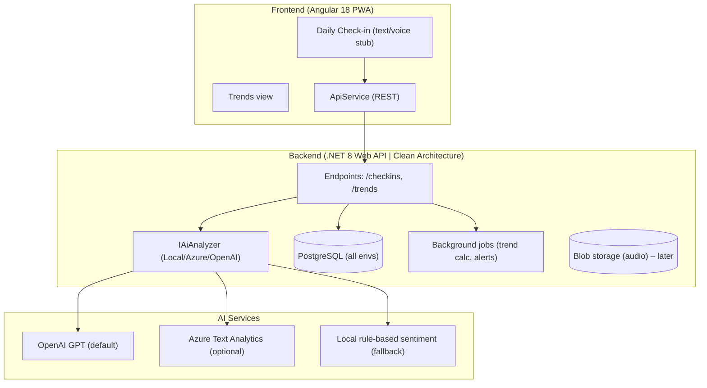

## Software Development Plan: hellotali – AI-Assisted Mood and Cognitive Monitoring (MVP)

### 1. Purpose and Scope
- **Goal**: Deliver a minimal yet production-ready MVP for AI-powered mood and cognitive monitoring to support mental health and dementia care.
- **Primary outcomes**:
  - Daily check-in (text first; voice optional stub) with immediate AI mood analysis.
  - Trend visualization over time and basic risk flagging.
  - Secure API and database foundation scalable to Azure.
- **Non-goals (MVP)**: Wearable/BLE integration, caregiver portal, clinician workflows, advanced personalization, regulatory certification.

### 2. Product Brief
- **Users**: Individuals at risk, people with anxiety/depression, early-stage dementia patients, caregivers (view-only later).
- **Core user flow**:
  1) Open app → 3–5 questions → submit text/voice.
  2) Backend analyzes mood and cognitive signals → returns score/label.
  3) App shows result and updates trend chart; optional alert if risk flagged.

### 3. Architecture Overview (MVP)


### 4. Repository Structure (monorepo)
```
root/
├─ backend/
│  ├─ HelloTali.sln
│  ├─ HelloTali.Domain/
│  ├─ HelloTali.Application/
│  ├─ HelloTali.Infrastructure/
│  └─ HelloTali.Api/
├─ frontend/
│  └─ hellotali-app/
├─ docs/
│  └─ app-plan.md
└─ .github/workflows/ (CI)
```

### 5. Technology Stack
- **Frontend**: Angular 18 (standalone), Angular Material, RxJS, PWA, SCSS.
- **Backend**: .NET 8, Clean Architecture, EF Core, PostgreSQL (all envs), Swagger.
- **AI**: Strategy pattern with pluggable implementations: OpenAI (default), Azure Text Analytics (optional), Local stub (fallback).
- **Infra**: Docker (dev via PostgreSQL container), Azure App Service/Container Apps + Azure Database for PostgreSQL (later).

### 6. Config and Environments
- Environments: `development`, `staging`, `production`.
- Secrets: Frontend – build-time envs; Backend – `appsettings.{Environment}.json` or Key Vault; prefer environment variables in containers.
- Feature flags: `AI_PROVIDER=openai` by default; `VOICE_ENABLED=true` (UI + backend stub only at MVP).
- Required secrets (backend): `OPENAI_API_KEY`, `OPENAI_MODEL` (e.g., `gpt-4o-mini`), `DATABASE_URL` (PostgreSQL), optional `AZURE_*` if used.

### 7. Security, Privacy, and Ethics (MVP)
- Consent screen before any data capture; clear privacy notice and crisis disclaimer.
- Encrypt transport (HTTPS) and at-rest DB disk encryption (host level).
- PII minimization: store `userId` as pseudonymous identifier; avoid storing raw audio in MVP.
- Basic crisis keyword detection; present helplines and advise contacting professionals; no autonomous escalation in MVP.
- Log redaction and access control; plan for HIPAA/GDPR alignment as scope grows.

### 8. Domain Model (MVP)
- `CheckIn`
  - `Id (GUID)`, `UserId (string)`, `SubmittedAt (DateTimeUtc)`, `Channel (text|voice)`, `TextAnswer (string?)`, `AudioUrl (string?)`.
- `AnalysisResult`
  - `Id (GUID)`, `CheckInId (GUID)`, `SentimentScore (double -1..1)`, `EmotionLabel (string: negative|neutral|positive)`, `CognitiveSignals (json)`, `RiskLevel (string: none|low|med|high)`, `AnalyzedAt (DateTimeUtc)`.

### 9. API Contracts (MVP)
- POST `/checkins`
  - Request:
    ```json
    {
      "userId": "u-123",
      "channel": "text",
      "textAnswer": "I felt a bit anxious but managed chores."
    }
    ```
  - Response:
    ```json
    {
      "checkInId": "guid",
      "sentimentScore": -0.12,
      "emotionLabel": "negative",
      "riskLevel": "low"
    }
    ```
- GET `/trends?userId=u-123&range=30d`
  - Response:
    ```json
    {
      "daily": [
        { "date": "2025-01-19", "score": -0.12 },
        { "date": "2025-01-20", "score": 0.20 }
      ],
      "weeklyAggregates": [
        { "week": "2025-W03", "avgScore": 0.05 }
      ],
      "alerts": [
        { "type": "trend_down", "message": "3-day decline detected" }
      ]
    }
    ```
- POST `/analysis/voice` (stub)
  - Request: `{ "userId": "u-123", "audioUrl": "https://..." }`
  - Response: same shape as `/checkins`.

### 10. Frontend UX (MVP)
- Pages
  - `Check-in`: 3–5 prompts, single text area submit; optional microphone UI (stub).
  - `Trends`: line chart of sentiment over time; list of alerts below.
- Components
  - `CheckInComponent`, `TrendsComponent`, `Navbar`, `ConsentDialog`.
- Services
  - `ApiService` for REST calls; `StorageService` for local settings; `FeatureFlagService`.

### 11. AI Adapter Strategy
- Interface `IAiAnalyzer.Analyze(text: string): AnalysisResult`.
- Implementations
  - `OpenAiGptAnalyzer` (default; low temperature; prompt guardrails; retry/backoff).
  - `AzureTextAnalyticsAnalyzer` (optional; keys/region).
  - `LocalRuleBasedAnalyzer` (fallback for outages/tests).
- Switching via `AI_PROVIDER` env var; default `openai`; fallback to local on failure.

### 12. Background Processing
- Initial: inline analysis on request.
- Later: scheduled job (e.g., Hangfire/Quartz) for weekly trend aggregation and alert generation.

### 13. Observability
- Request/response timing, error rates, dependency health.
- Frontend analytics: route views, submission success/fail (anonymous).
- Log structure: JSON logs, correlation ID per request.

### 14. CI/CD
- GitHub Actions
  - Backend: build + test + publish Docker image (includes EF Core migrations). Use PostgreSQL service in CI for integration tests.
  - Frontend: install, lint, test, build; upload static artifact; deploy to static hosting.
- Environments: `development` (manual), `staging` (auto on main), `production` (manual approval).

### 15. Quality Engineering
- Testing strategy
  - Backend: unit tests (domain, analyzer), integration tests (API + EF Core + PostgreSQL test container), contract tests for AI adapters (mocked).
  - Frontend: unit tests (components/services), e2e happy path (check-in, trends).
  - Accessibility checks (WCAG AA focus order, contrast, keyboard nav).
- Performance: P95 API < 300ms on local analyzer; < 1.5s with external AI.
- Security: basic dependency scanning, headers (CORS, CSP later), input validation.

### 16. Milestones and Sprints
- Milestone 0 – Project Setup (0.5–1 day)
  - Monorepo structure; tooling; CI skeleton; Prettier/ESLint/EditorConfig.
- Milestone 1 – Backend MVP (2–3 days)
  - Entities, EF Core (PostgreSQL), `/checkins`, `/trends`, OpenAI analyzer, Swagger.
  - Seed data script; minimal trend logic; CORS for frontend; `docker-compose` for local PG.
- Milestone 2 – Frontend MVP (2–3 days)
  - Angular app, Material shell, Check-in + Trends pages, API integration, PWA.
- Milestone 3 – Hardening (1–2 days)
  - Consent screen, basic crisis keyword detection, a11y pass, logging/metrics.
- Milestone 4 – Optional Integrations (time-boxed)
  - Azure/OpenAI adapter, voice upload stub, deploy to Azure App Service.

### 17. Acceptance Criteria (MVP)
- A user can complete a daily text check-in and receive immediate analysis.
- Trends page displays last 30 days with accurate aggregation.
- Basic risk flag appears when negative trend or crisis keywords detected.
- All API endpoints documented in Swagger and pass integration tests.
- CI builds succeed; app runs locally with a single command per app.

### 18. Risk Register (selected)
- External AI dependency latency/outage → Mitigate with local fallback.
- Privacy concerns → Minimize PII, explicit consent, no audio storage in MVP.
- Engagement drop-off → Keep daily prompts short, reminders (PWA notifications later).
- Bias/accuracy limits → Label outputs as supportive insights, not diagnosis.

### 19. Local Development – Quickstart
- Backend
  - Prereqs: .NET 8 SDK, Docker Desktop (for PostgreSQL).
  - Start DB: `docker compose -f infra/docker-compose.postgres.yml up -d`
  - Commands:
    - `cd backend/HelloTali.Api`
    - `setx DATABASE_URL "Host=localhost;Port=5432;Database=hellotali;Username=dev;Password=devpass"`
    - `setx AI_PROVIDER openai`
    - `setx OPENAI_API_KEY <your_key>`
    - `dotnet run`
    - Swagger: `https://localhost:5001/swagger`
- Frontend
  - Prereqs: Node 18+, npm, Angular CLI.
  - Commands:
    - `cd frontend/hellotali-app`
    - `npm install`
    - `npm start` (dev server at `http://localhost:4200`)
- Env variables
  - Backend: `AI_PROVIDER=openai`, `OPENAI_API_KEY`, `DATABASE_URL` (PostgreSQL).
  - Frontend: `API_BASE_URL` in `environment.ts`.

### 20. Future Roadmap (post-MVP)
- Voice analysis (on-device or cloud), caregiver alerts, clinician portal.
- Wearable/BLE integrations; geofencing and safety alerts.
- Advanced personalization; multilingual support; EHR integration.
- Security hardening (OAuth2/OIDC), Key Vault, DLP, PHI audit trails.

### 21. Definitions of Done
- Code reviewed, tests passing, lint clean, docs updated, observable in logs, feature flags respected, and user-facing copy reviewed for clarity and safety.

### 22. References
- See `AI app proposal/ai_mood_monitoring_proposal.md` for background objectives and scope.

