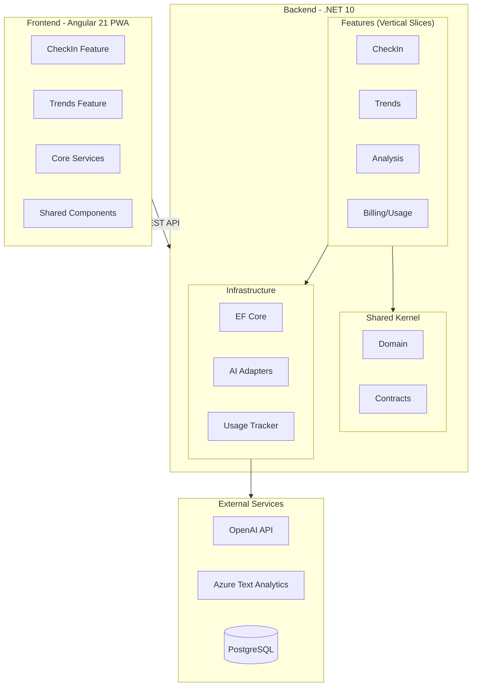
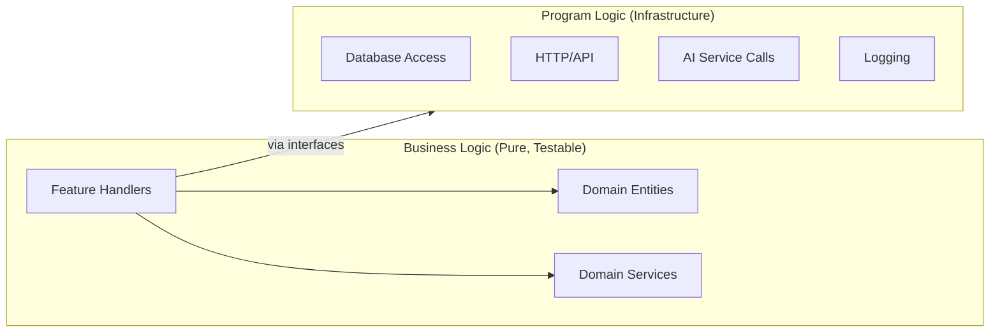
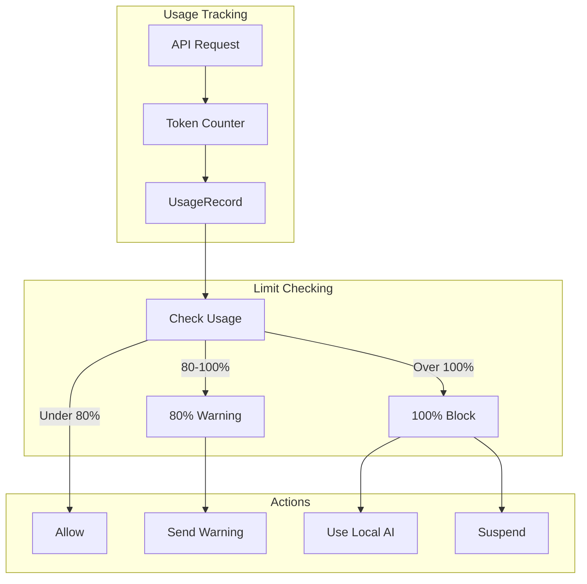
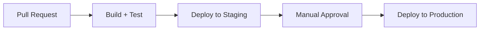

# Software Development Plan: hellotali – AI-Assisted Mood and Cognitive Monitoring

## Table of Contents

1. [Purpose and Scope](#1-purpose-and-scope)
2. [Technology Stack](#2-technology-stack)
3. [Architecture Overview](#3-architecture-overview)
4. [Backend Structure (Vertical Slice)](#4-backend-structure-vertical-slice)
5. [Frontend Structure (Feature-based)](#5-frontend-structure-feature-based)
6. [SOLID Principles Application](#6-solid-principles-application)
7. [Business vs Program Logic Separation](#7-business-vs-program-logic-separation)
8. [Domain Model](#8-domain-model)
9. [API Contracts](#9-api-contracts)
10. [AI Usage Monitoring Feature](#10-ai-usage-monitoring-feature)
11. [Config and Environments](#11-config-and-environments)
12. [Security and Privacy](#12-security-and-privacy)
13. [CI/CD](#13-cicd)
14. [Testing Strategy](#14-testing-strategy)
15. [Milestones](#15-milestones)
16. [References](#16-references)

---

## 1. Purpose and Scope

**Goal**: Deliver a production-ready MVP for AI-powered mood and cognitive monitoring to support mental health and dementia care.

**Primary outcomes**:
- Daily check-in (text first; voice stub) with immediate AI mood analysis
- Trend visualization over time and basic risk flagging
- AI usage monitoring with billing controls
- Secure API and database foundation scalable to Azure

**Non-goals (MVP)**: Wearable/BLE integration, caregiver portal, clinician workflows, regulatory certification.

---

## 2. Technology Stack

| Layer | Technology | Version | Notes |
|-------|------------|---------|-------|
| **Frontend** | Angular | 21 (LTS) | Standalone components, Material, PWA |
| **Backend** | .NET | 10 (LTS) | Minimal APIs, vertical slice architecture |
| **Database** | PostgreSQL | 16+ | All environments |
| **AI (default)** | OpenAI | GPT-4o-mini | Token tracking, fallback support |
| **AI (optional)** | Azure Text Analytics | Latest | Sentiment analysis |
| **AI (fallback)** | Local rule-based | N/A | Zero cost, offline capable |
| **Infra** | Docker | Latest | Local PostgreSQL, optional deployment |

---

## 3. Architecture Overview



---

## 4. Backend Structure (Vertical Slice)

```
backend/
├── HelloTali.sln
├── src/
│   ├── HelloTali.Api/                    # Host, Program.cs, middleware
│   │   ├── Program.cs
│   │   ├── appsettings.json
│   │   └── appsettings.Development.json
│   │
│   ├── HelloTali.Features/               # VERTICAL SLICES
│   │   ├── CheckIn/
│   │   │   ├── CheckInEndpoints.cs       # Minimal API endpoints
│   │   │   ├── CreateCheckIn/
│   │   │   │   ├── CreateCheckInCommand.cs
│   │   │   │   ├── CreateCheckInHandler.cs
│   │   │   │   └── CreateCheckInValidator.cs
│   │   │   ├── GetCheckIn/
│   │   │   │   ├── GetCheckInQuery.cs
│   │   │   │   └── GetCheckInHandler.cs
│   │   │   └── Models/
│   │   │       └── CheckInDto.cs
│   │   │
│   │   ├── Trends/
│   │   │   ├── TrendsEndpoints.cs
│   │   │   ├── GetTrends/
│   │   │   │   ├── GetTrendsQuery.cs
│   │   │   │   └── GetTrendsHandler.cs
│   │   │   └── Models/
│   │   │       └── TrendDto.cs
│   │   │
│   │   ├── Analysis/
│   │   │   ├── AnalysisEndpoints.cs
│   │   │   ├── AnalyzeMood/
│   │   │   │   ├── AnalyzeMoodCommand.cs
│   │   │   │   └── AnalyzeMoodHandler.cs
│   │   │   └── Models/
│   │   │       └── AnalysisDto.cs
│   │   │
│   │   └── Billing/
│   │       ├── BillingEndpoints.cs
│   │       ├── GetUsage/
│   │       │   ├── GetUsageQuery.cs
│   │       │   └── GetUsageHandler.cs
│   │       └── Models/
│   │           └── UsageDto.cs
│   │
│   ├── HelloTali.Domain/                 # BUSINESS LOGIC (pure, no dependencies)
│   │   ├── Entities/
│   │   │   ├── CheckIn.cs
│   │   │   ├── AnalysisResult.cs
│   │   │   └── UsageRecord.cs
│   │   ├── ValueObjects/
│   │   │   ├── MoodScore.cs
│   │   │   ├── RiskLevel.cs
│   │   │   └── UsageStatus.cs
│   │   ├── Events/
│   │   │   └── CheckInCreatedEvent.cs
│   │   └── Services/
│   │       └── RiskAssessmentService.cs
│   │
│   ├── HelloTali.Contracts/              # INTERFACES (for DI)
│   │   ├── AI/
│   │   │   └── IAiAnalyzer.cs
│   │   ├── Persistence/
│   │   │   ├── ICheckInRepository.cs
│   │   │   └── IUsageRepository.cs
│   │   └── Services/
│   │       ├── ITrendCalculator.cs
│   │       └── IUsageTracker.cs
│   │
│   └── HelloTali.Infrastructure/         # PROGRAM LOGIC (implementations)
│       ├── Persistence/
│       │   ├── HelloTaliDbContext.cs
│       │   ├── Migrations/
│       │   └── Repositories/
│       │       ├── CheckInRepository.cs
│       │       └── UsageRepository.cs
│       ├── AI/
│       │   ├── OpenAiAnalyzer.cs
│       │   ├── AzureTextAnalyzer.cs
│       │   └── LocalRuleBasedAnalyzer.cs
│       └── Services/
│           ├── TrendCalculator.cs
│           └── UsageTrackerService.cs
│
├── tests/
│   ├── HelloTali.Features.Tests/
│   ├── HelloTali.Domain.Tests/
│   └── HelloTali.Infrastructure.Tests/
│
└── Directory.Build.props
```

---

## 5. Frontend Structure (Feature-based)

```
frontend/hellotali-app/
├── src/
│   ├── app/
│   │   ├── features/                     # VERTICAL SLICES
│   │   │   ├── check-in/
│   │   │   │   ├── check-in.routes.ts
│   │   │   │   ├── pages/
│   │   │   │   │   └── check-in-page.component.ts
│   │   │   │   ├── components/
│   │   │   │   │   ├── question-card.component.ts
│   │   │   │   │   └── mood-result.component.ts
│   │   │   │   ├── services/
│   │   │   │   │   └── check-in.service.ts
│   │   │   │   └── models/
│   │   │   │       └── check-in.model.ts
│   │   │   │
│   │   │   ├── trends/
│   │   │   │   ├── trends.routes.ts
│   │   │   │   ├── pages/
│   │   │   │   │   └── trends-page.component.ts
│   │   │   │   ├── components/
│   │   │   │   │   ├── trend-chart.component.ts
│   │   │   │   │   └── alert-list.component.ts
│   │   │   │   ├── services/
│   │   │   │   │   └── trends.service.ts
│   │   │   │   └── models/
│   │   │   │       └── trend.model.ts
│   │   │   │
│   │   │   └── billing/
│   │   │       ├── billing.routes.ts
│   │   │       ├── pages/
│   │   │       │   └── usage-page.component.ts
│   │   │       ├── services/
│   │   │       │   └── billing.service.ts
│   │   │       └── models/
│   │   │           └── usage.model.ts
│   │   │
│   │   ├── core/                         # SHARED INFRASTRUCTURE
│   │   │   ├── services/
│   │   │   │   ├── api.service.ts
│   │   │   │   └── storage.service.ts
│   │   │   ├── interceptors/
│   │   │   │   └── error.interceptor.ts
│   │   │   └── guards/
│   │   │       └── consent.guard.ts
│   │   │
│   │   ├── shared/                       # SHARED UI
│   │   │   ├── components/
│   │   │   │   ├── loading-spinner/
│   │   │   │   ├── consent-dialog/
│   │   │   │   └── navbar/
│   │   │   └── pipes/
│   │   │       └── date-ago.pipe.ts
│   │   │
│   │   ├── app.routes.ts
│   │   ├── app.component.ts
│   │   └── app.config.ts
│   │
│   ├── environments/
│   │   ├── environment.ts
│   │   └── environment.production.ts
│   │
│   ├── styles.scss
│   └── index.html
│
├── angular.json
├── package.json
└── tsconfig.json
```

---

## 6. SOLID Principles Application

| Principle | Backend | Frontend |
|-----------|---------|----------|
| **S** - Single Responsibility | Each handler does one thing; domain entities own their state | Each component has one purpose; services handle one concern |
| **O** - Open/Closed | New AI analyzers via interface; no modification to existing code | New features as new modules; no modification to core |
| **L** - Liskov Substitution | All `IAiAnalyzer` implementations interchangeable | Services implement consistent contracts |
| **I** - Interface Segregation | Small interfaces: `IAiAnalyzer`, `ICheckInRepository` | Feature-specific services, not god services |
| **D** - Dependency Inversion | Features depend on `Contracts`; Infrastructure implements | Services injected via DI; components don't know implementations |

---

## 7. Business vs Program Logic Separation



**Business Logic** (no external dependencies):
- Domain entities with validation and behavior
- Domain services (e.g., risk assessment rules)
- Feature handlers (orchestration)

**Program Logic** (infrastructure):
- Database access (EF Core)
- External API calls (OpenAI, Azure)
- Logging, caching, messaging

---

## 8. Domain Model

### CheckIn
```csharp
public class CheckIn
{
    public Guid Id { get; private set; }
    public string UserId { get; private set; }
    public DateTime SubmittedAt { get; private set; }
    public string Channel { get; private set; } // "text" | "voice"
    public string? TextAnswer { get; private set; }
    public string? AudioUrl { get; private set; }
    public AnalysisResult? Analysis { get; private set; }
}
```

### AnalysisResult
```csharp
public class AnalysisResult
{
    public Guid Id { get; private set; }
    public Guid CheckInId { get; private set; }
    public MoodScore SentimentScore { get; private set; }
    public string EmotionLabel { get; private set; }
    public string CognitiveSignalsJson { get; private set; }
    public RiskLevel RiskLevel { get; private set; }
    public int TokensUsed { get; private set; }
    public DateTime AnalyzedAt { get; private set; }
}
```

### UsageRecord
```csharp
public class UsageRecord
{
    public Guid Id { get; private set; }
    public string UserId { get; private set; }
    public string Month { get; private set; } // "YYYY-MM"
    public long TokensUsed { get; private set; }
    public long TokenLimit { get; private set; }
    public decimal CostEstimate { get; private set; }
    public UsageStatus Status { get; private set; } // Active, Warning, Suspended
    public DateTime LastUpdated { get; private set; }
}
```

---

## 9. API Contracts

### POST `/api/checkins`
```json
// Request
{
  "userId": "u-123",
  "channel": "text",
  "textAnswer": "I felt a bit anxious but managed chores."
}

// Response 201
{
  "checkInId": "guid",
  "sentimentScore": -0.12,
  "emotionLabel": "negative",
  "riskLevel": "low",
  "tokensUsed": 150
}
```

### GET `/api/trends?userId=u-123&range=30d`
```json
// Response 200
{
  "daily": [
    { "date": "2026-01-07", "score": -0.12 },
    { "date": "2026-01-08", "score": 0.20 }
  ],
  "weeklyAggregates": [
    { "week": "2026-W02", "avgScore": 0.05 }
  ],
  "alerts": [
    { "type": "trend_down", "message": "3-day decline detected" }
  ]
}
```

### GET `/api/billing/usage?userId=u-123`
```json
// Response 200
{
  "month": "2026-01",
  "tokensUsed": 15000,
  "tokenLimit": 100000,
  "costEstimate": 2.25,
  "status": "active",
  "percentUsed": 15
}
```

---

## 10. AI Usage Monitoring Feature



**Behavior**:
1. Before each AI call: Check `UsageRecord.Status`
2. After each AI call: Update `TokensUsed`, recalculate `CostEstimate`
3. At 80% of limit: Set status to `Warning`, trigger notification
4. At 100% of limit: Set status to `Suspended`, switch to local fallback
5. On payment: Reset/increase limit, set status to `Active`

---

## 11. Config and Environments

| Environment | Database | AI Provider | Usage Limits |
|-------------|----------|-------------|--------------|
| `development` | Local PostgreSQL (Docker) | Local fallback | Unlimited |
| `staging` | Azure PostgreSQL | OpenAI | 100k tokens/month |
| `production` | Azure PostgreSQL | OpenAI | Per-user limits |

**Required Secrets**:
- `DATABASE_URL` - PostgreSQL connection string
- `OPENAI_API_KEY` - OpenAI API key
- `OPENAI_MODEL` - Model name (default: `gpt-4o-mini`)
- `AI_PROVIDER` - `openai`, `azure`, or `local`

---

## 12. Security and Privacy

- Consent screen before any data capture
- HTTPS transport encryption
- Database encryption at rest
- PII minimization: pseudonymous `userId`
- Basic crisis keyword detection with helpline info
- No raw audio storage in MVP
- GDPR/HIPAA-aligned design

---

## 13. CI/CD



- **Backend**: Build, test (PostgreSQL service in CI), Docker image
- **Frontend**: Install, lint, test, build static artifact
- **Environments**: development (manual), staging (auto on main), production (manual approval)

---

## 14. Testing Strategy

| Layer | Test Type | Tools |
|-------|-----------|-------|
| Domain | Unit tests | xUnit, FluentAssertions |
| Features | Integration tests | WebApplicationFactory, Testcontainers |
| Infrastructure | Contract tests | Moq, WireMock |
| Frontend | Unit tests | Jest, Angular Testing Library |
| Frontend | E2E | Playwright |

---

## 15. Milestones

| Milestone | Duration | Deliverables |
|-----------|----------|--------------|
| 0. Setup | 0.5 days | Monorepo, tooling, CI skeleton |
| 1. Backend MVP | 2-3 days | CheckIn, Trends, AI adapter, Swagger |
| 2. Frontend MVP | 2-3 days | Angular app, Check-in, Trends pages |
| 3. Usage Monitoring | 1-2 days | Token tracking, billing endpoints |
| 4. Hardening | 1-2 days | Consent, crisis detection, a11y |
| 5. Documentation | 1 day | User manuals, architecture docs |

---

## 16. References

- [AI app proposal/ai_mood_monitoring_proposal.md](../AI%20app%20proposal/ai_mood_monitoring_proposal.md)
- [docs/architecture.md](architecture.md)
- [docs/procedure.md](procedure.md)
