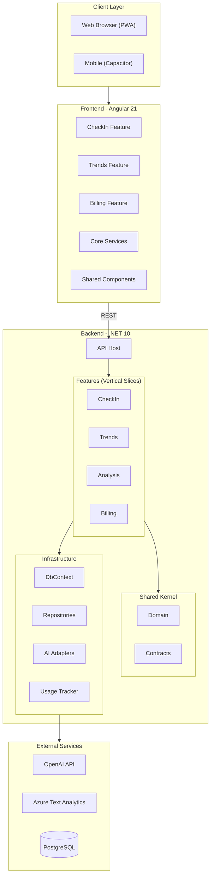
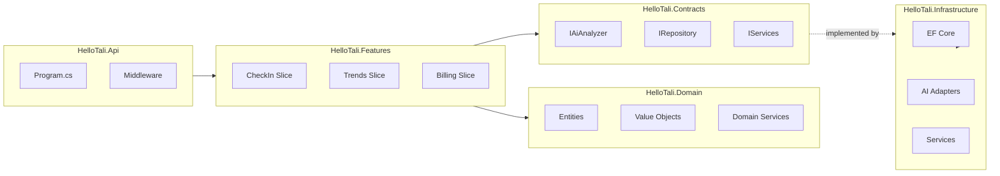
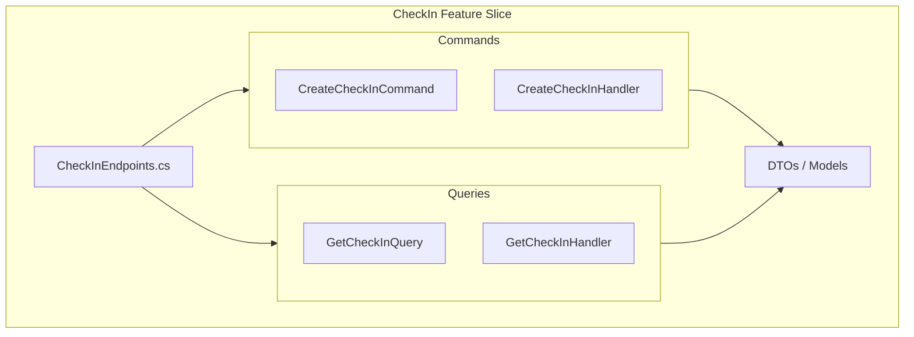
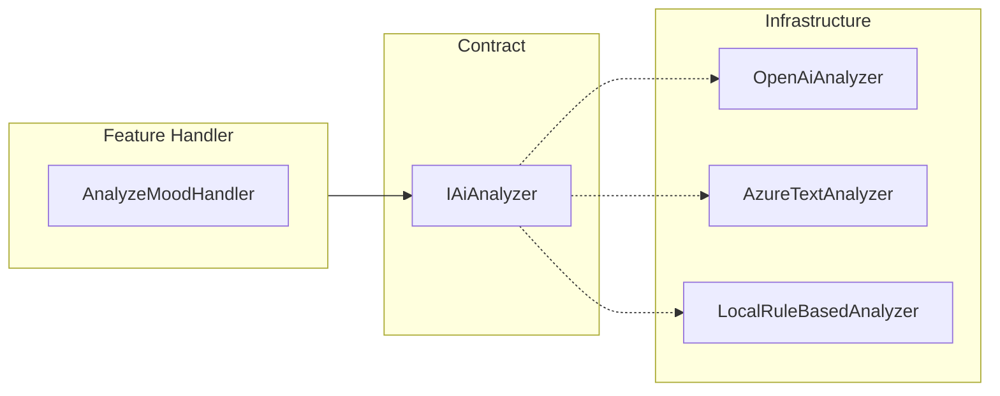
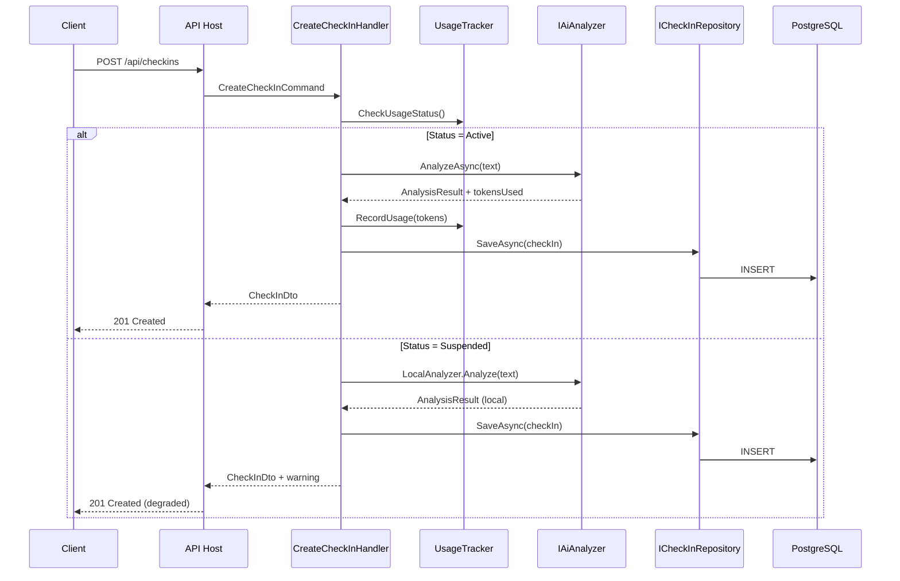
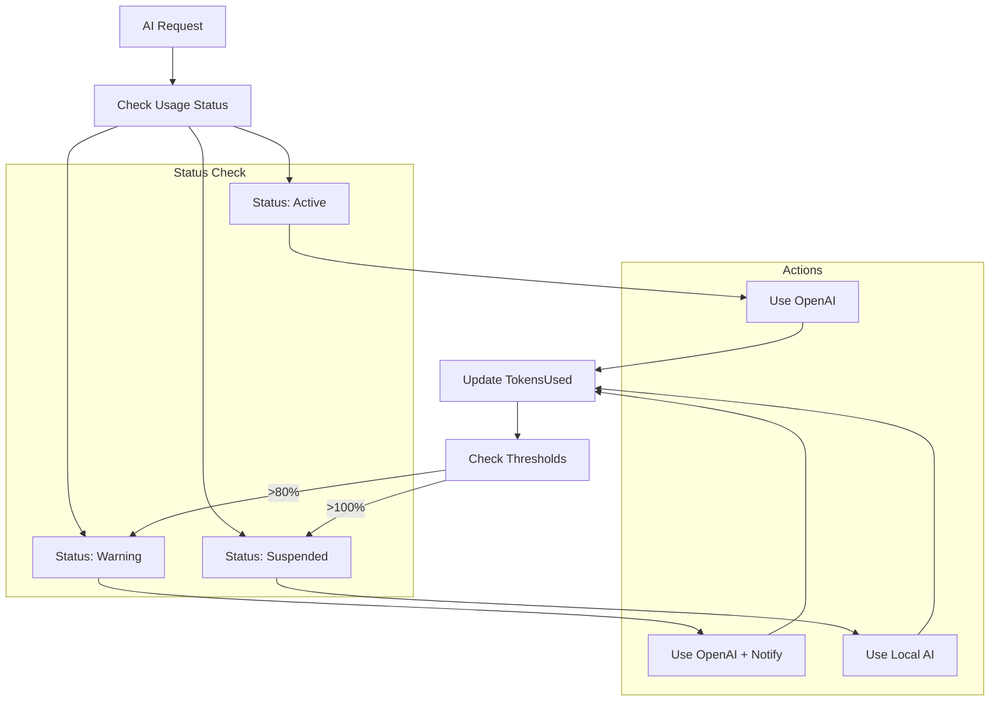
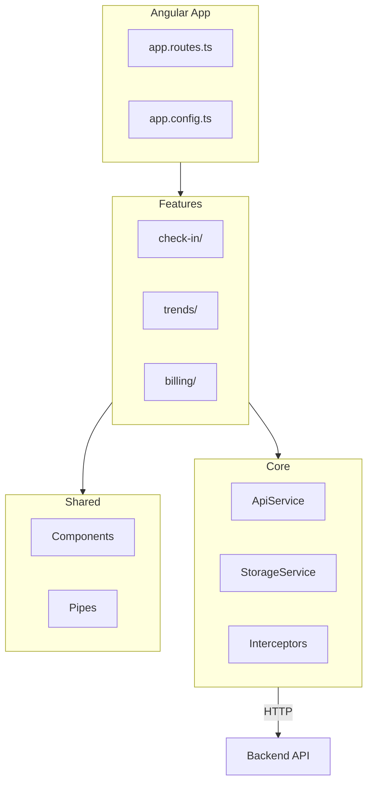
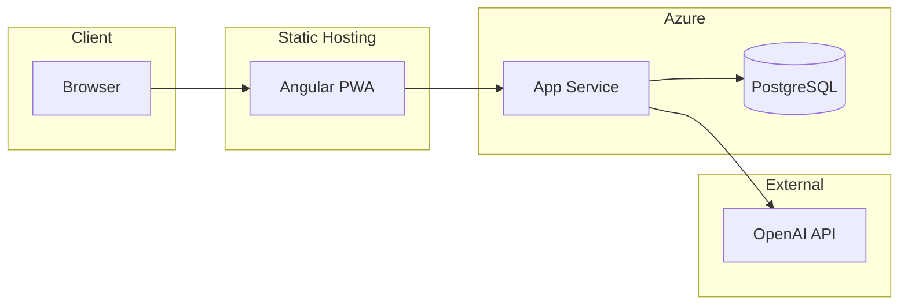

# System Architecture – hellotali

## Overview

hellotali uses a **Vertical Slice Architecture** where features are organized as self-contained slices rather than horizontal layers. Each slice contains its own endpoints, handlers, models, and tests.

---

## High-Level Architecture

---

## Backend Layers

---

## Feature Slice Structure

Each feature is self-contained:

---

## AI Adapter Strategy

Switching via `AI_PROVIDER` environment variable:
- `openai` (default) → OpenAiAnalyzer
- `azure` → AzureTextAnalyzer
- `local` → LocalRuleBasedAnalyzer (fallback)

---

## Data Flow: Check-in Request

---

## Usage Monitoring Flow

---

## Frontend Architecture

---

## Deployment Architecture

---

## Key Design Decisions

1. **Vertical Slices over Layers** - Features are self-contained for easier maintenance
2. **Contracts for DI** - All dependencies injected via interfaces
3. **Domain Purity** - Business logic has no external dependencies
4. **AI Fallback** - Local analyzer ensures service continuity
5. **Usage Tracking** - Built-in cost control and billing support
