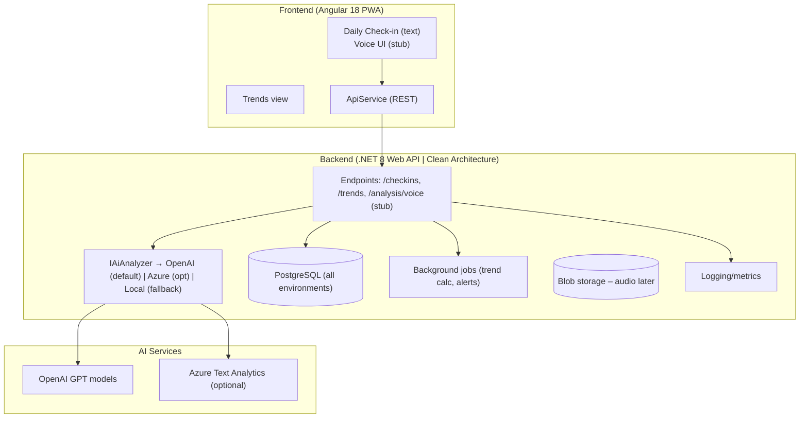

## System Architecture – hellotali (MVP)

### Diagram

### Notes
- OpenAI is the default AI provider in MVP; Azure/TextAnalytics and Local analyzer remain available via feature flag.
- PostgreSQL is used across development, staging, and production for parity.
- Voice support is UI + backend stub initially; actual audio processing can be added later.

